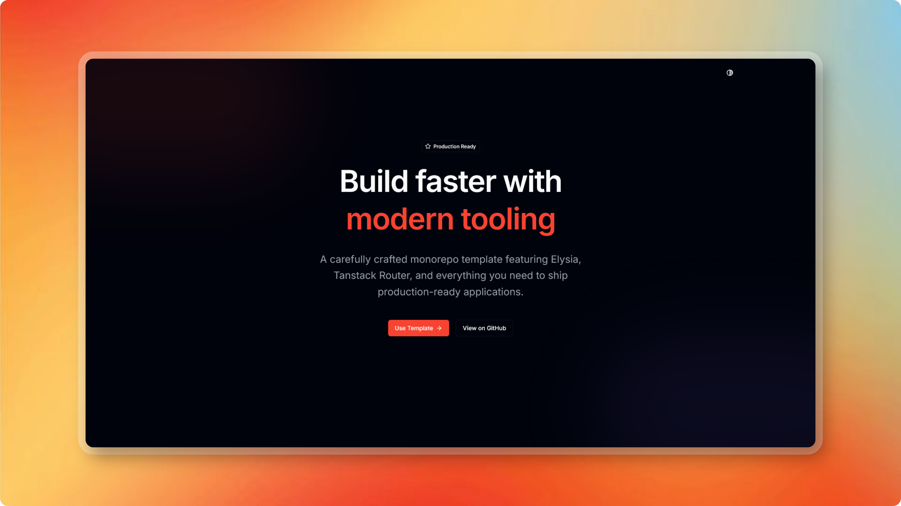

<div align="center">

# Monorepo Template

Monorepo template for full-stack development with TypeScript, React, Bun, and Elysia.

</div>

## 🚀 Main Technologies

<table>
<thead>
<tr>
<th>Name</th>
<th>Description</th>
<th>Docs</th>
</tr>
</thead>
<tbody>
<tr>
<td colspan="2"><strong>Runtime & Build Tools</strong></td>
<td></td>
</tr>
<tr>
<td><a href="https://bun.sh/">Bun</a></td>
<td>High-performance JavaScript/TypeScript runtime</td>
<td><a href="https://bun.sh/docs">Link</a></td>
</tr>
<tr>
<td><a href="https://turbo.build/">Turbo</a></td>
<td>Build system for monorepos</td>
<td><a href="https://turbo.build/repo/docs">Link</a></td>
</tr>
<tr>
<td colspan="2"><strong>Frontend</strong></td>
<td></td>
</tr>
<tr>
<td><a href="https://react.dev/">React</a></td>
<td>Library for user interfaces</td>
<td><a href="https://react.dev/">Link</a></td>
</tr>
<tr>
<td><a href="https://tanstack.com/router">TanStack Router</a></td>
<td>Type-safe routing</td>
<td><a href="https://tanstack.com/router/latest">Link</a></td>
</tr>
<tr>
<td><a href="https://tanstack.com/query">TanStack Query</a></td>
<td>Server state management</td>
<td><a href="https://tanstack.com/query/latest">Link</a></td>
</tr>
<tr>
<td><a href="https://vitejs.dev/">Vite</a></td>
<td>Build tool and dev server</td>
<td><a href="https://vitejs.dev/">Link</a></td>
</tr>
<tr>
<td><a href="https://tailwindcss.com/">Tailwind CSS</a></td>
<td>Utility-first CSS framework</td>
<td><a href="https://tailwindcss.com/docs">Link</a></td>
</tr>
<tr>
<td colspan="2"><strong>Backend</strong></td>
<td></td>
</tr>
<tr>
<td><a href="https://elysiajs.com/">Elysia</a></td>
<td>Fast TypeScript web framework</td>
<td><a href="https://elysiajs.com/">Link</a></td>
</tr>
<tr>
<td><a href="https://www.better-auth.com/">Better Auth</a></td>
<td>Authentication system</td>
<td><a href="https://www.better-auth.com/docs">Link</a></td>
</tr>
<tr>
<td colspan="2"><strong>Database</strong></td>
<td></td>
</tr>
<tr>
<td><a href="https://orm.drizzle.team/">Drizzle ORM</a></td>
<td>TypeScript ORM for PostgreSQL</td>
<td><a href="https://orm.drizzle.team/">Link</a></td>
</tr>
<tr>
<td><a href="https://www.postgresql.org/">PostgreSQL</a></td>
<td>Relational database</td>
<td><a href="https://www.postgresql.org/docs/">Link</a></td>
</tr>
<tr>
<td><a href="https://redis.io/">Redis</a></td>
<td>Cache and in-memory storage</td>
<td><a href="https://redis.io/docs/">Link</a></td>
</tr>
<tr>
<td colspan="2"><strong>DevOps & Deploy</strong></td>
<td></td>
</tr>
<tr>
<td><a href="https://vercel.com/">Vercel</a></td>
<td>Frontend deployment</td>
<td><a href="https://vercel.com/docs">Link</a></td>
</tr>
<tr>
<td><a href="https://www.docker.com/">Docker</a></td>
<td>API image and local Postgres/Redis</td>
<td><a href="https://docs.docker.com/">Link</a></td>
</tr>
<tr>
<td><a href="https://docs.github.com/en/packages/working-with-a-github-packages-registry/working-with-the-container-registry">GitHub Container Registry</a></td>
<td>API image registry</td>
<td><a href="https://docs.github.com/en/packages/working-with-a-github-packages-registry/working-with-the-container-registry">Link</a></td>
</tr>
<tr>
<td><a href="https://docs.github.com/en/actions">GitHub Actions</a></td>
<td>CI/CD</td>
<td><a href="https://docs.github.com/en/actions">Link</a></td>
</tr>
<tr>
<td colspan="2"><strong>Code Quality</strong></td>
<td></td>
</tr>
<tr>
<td><a href="https://biomejs.dev/">Biome</a></td>
<td>Linter and formatter</td>
<td><a href="https://biomejs.dev/">Link</a></td>
</tr>
<tr>
<td><a href="https://www.typescriptlang.org/">TypeScript</a></td>
<td>JavaScript superset with types</td>
<td><a href="https://www.typescriptlang.org/docs/">Link</a></td>
</tr>
</tbody>
</table>

## 📦 Project Structure

```
monorepo-template/
├── apps/
│   ├── api/          # Backend API (Elysia + Bun)
│   └── web/          # Frontend (React + Vite)
├── packages/
│   ├── auth/         # Authentication (Better Auth)
│   ├── cache/         # Cache (Redis)
│   ├── database/      # Database (Drizzle + PostgreSQL)
│   ├── design-system/ # Shared UI components
│   ├── linter/        # Linting configuration
│   ├── tsconfig/      # TypeScript configurations
│   └── validation/    # Validation schemas (Zod)
└── scripts/           # Utility scripts
```

## 🛠️ How to Use

This project is a template. To create a new repository from this template:

1. Click the **"Use this template"** button on GitHub
2. Follow the instructions to create your repository
3. Clone the created repository
4. Configure environment variables (see sections below)

## 🔐 Environment Variables

### Local Configuration

For local development, you can automatically create `.env` files from `.env.example` files by running:

```bash
bun run build:envs
```

This command will copy all `.env.example` files to `.env` in the respective apps/packages. After that, you can configure the values in each `.env` file. Check the documentation for each app/package:

- 📖 [API - Environment Variables](./apps/api/README.md#environment-variables)
- 📖 [Web - Environment Variables](./apps/web/README.md#environment-variables)
- 📖 [Auth Package](./packages/auth/README.md)
- 📖 [Database Package](./packages/database/README.md)
- 📖 [Cache Package](./packages/cache/README.md)

## 🚢 Deploy and CI/CD

The project uses GitHub Actions for automatic CI/CD. The workflow runs on **push to `main`**.

### How It Works

1. **Trigger:** Pushing to `main` (when web, API, packages, or lockfile files change)
2. **Checks:** Type check and lint
3. **Change Detection:** The workflow detects changes in `apps/web` or `apps/api`
4. **Publish:**
   - **Web:** Deploy to Vercel
   - **API:** Compile a Linux Alpine binary, build the Docker image, and push it to GitHub Container Registry (`ghcr.io/<owner>/<repo>/api`)

GHCR authentication uses the workflow `GITHUB_TOKEN`. No extra API-registry secret is required. The first published package is often **private** until you change visibility under **Packages**.

### GitHub Secrets Configuration

For the Vercel deploy to work, add the following secret on GitHub:

#### 1. Access Secrets Configuration

1. Go to the repository on GitHub
2. Click **Settings**
3. In the sidebar, click **Secrets and variables** → **Actions**
4. Click **New repository secret**

#### 2. Required Secrets

##### `VERCEL_TOKEN`

Vercel access token for frontend deployment.

**How to get:**

1. Go to [Vercel Dashboard](https://vercel.com/dashboard)
2. Go to **Settings** → **Tokens**
3. Click **Create Token**
4. Give the token a name (e.g., "GitHub Actions")
5. Copy the generated token
6. **Documentation:** [Vercel - Authentication](https://vercel.com/docs/security/api-tokens)

**Add to GitHub:**

- Name: `VERCEL_TOKEN`
- Value: Paste the copied token
- Click **Add secret**

### Environment Variables Configuration on Platforms

#### API container (GitHub Container Registry)

CI publishes the image; it does not start a live API. Pull and run it wherever you host containers, and pass the same environment variables documented in [apps/api/README.md](./apps/api/README.md#environment-variables).

Image tags:

- `ghcr.io/<owner>/<repo>/api:latest`
- `ghcr.io/<owner>/<repo>/api:sha-<short-sha>`

```bash
docker pull ghcr.io/<owner>/<repo>/api:latest
docker run --env-file apps/api/.env -p 3001:3001 ghcr.io/<owner>/<repo>/api:latest
```

Replace `<owner>/<repo>` with your GitHub repository, for example `octocat/monorepo-template`.

#### Vercel (Frontend)

**Via Dashboard:**

1. Go to [Vercel Dashboard](https://vercel.com/dashboard)
2. Select your project (`monorepo-template-web`)
3. Go to **Settings** → **Environment Variables**
4. Add the variable:
   - **Key:** `VITE_API_URL`
   - **Value:** Your API URL (e.g., `https://api.example.com`)
   - **Environment:** Production, Preview, Development (select as needed)
5. Click **Save**
6. **Documentation:** [Vercel - Environment Variables](https://vercel.com/docs/projects/environment-variables)

**Reference Links:**

- 📖 [Vercel - Environment Variables](https://vercel.com/docs/projects/environment-variables)
- 📖 [Vercel - Deployments](https://vercel.com/docs/deployments/overview)

## 📚 Apps and Packages Documentation

### Apps

- 📖 [API](./apps/api/README.md) - Backend API with Elysia
- 📖 [Web](./apps/web/README.md) - Frontend with React

### Packages

- 📖 [Auth](./packages/auth/README.md) - Authentication with Better Auth
- 📖 [Database](./packages/database/README.md) - Database with Drizzle ORM
- 📖 [Cache](./packages/cache/README.md) - Cache with Redis

## 🧑‍💻 Development

### Prerequisites

- [Bun](https://bun.sh/) installed (version 1.3.3 or higher)
- Docker and Docker Compose (for local database)

### ⚠️ TypeScript Configuration Warning

**Important:** It's recommended to use the minimum of TypeScript aliases (`paths` in `tsconfig.json`) in packages, as it can cause conflicts with apps during type checking. Prefer using relative imports or direct package imports when possible.

### Main Commands

```bash
# Install dependencies
bun install

# Development (all apps)
bun dev

# Build (all apps)
bun build

# Linting
bun lint

# Formatting
bun format
```

### Available Scripts

- `bun dev` - Starts all apps in development mode
- `bun build` - Builds all apps
- `bun preview` - Preview of builds
- `bun lint` - Runs the linter
- `bun format` - Formats the code
- `bun check` - Checks code and formatting
- `bun check:write` - Automatically fixes found issues

## 📝 Notes

### Bun Warning on Windows

When running `bun run dev` on Windows, you may see a message about files "outside the project directory" not being watched. This is a Windows limitation related to the limited number of file watchers. It's just a safety measure from Bun and doesn't affect functionality. For more details, see the [API README](./apps/api/README.md).

## 🔗 Useful Links

- [Bun Documentation](https://bun.sh/docs)
- [Turbo Documentation](https://turbo.build/repo/docs)
- [Elysia Documentation](https://elysiajs.com/)
- [React Documentation](https://react.dev/)
- [Vercel Documentation](https://vercel.com/docs)
- [Docker Documentation](https://docs.docker.com/)
- [GitHub Container Registry](https://docs.github.com/en/packages/working-with-a-github-packages-registry/working-with-the-container-registry)
